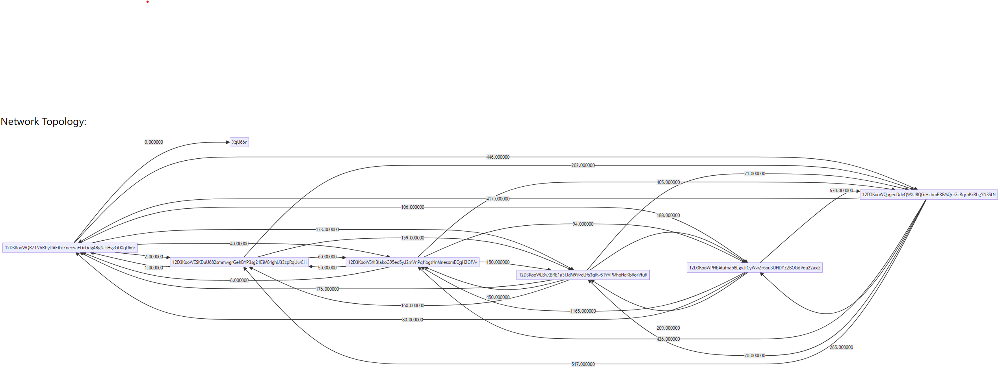

# PureGamer: An Experimental Distributed Game Accelerator with Automatic Routing

PureGamer is an experimental distributed game accelerator with automatic routing.

It is designed to accelerate online games by routing game traffic through the shortest path between the game server and the player.

PureGamer is built on top of the [LibP2P](https://libp2p.io/) networking stack.

## Features
- Automatic routing: PureGamer automatically choose the route with the lowest latency between the game server and the player.
- Distributed: PureGamer is a distributed system that can be run on multiple nodes.
- Scalable: PureGamer can be easily scaled by adding more nodes to the network.
- Secure: PureGamer uses end-to-end encryption to secure the game traffic.
- Open-source: PureGamer is an open-source project that is free to use and modify.

## How it works
PureGamer use LibP2P to create a peer-to-peer network.

It used Gossip PubSub to broadcast the latency information between the nodes.

Nodes receive the latency information from other nodes and use it to calculate the shortest path between the game server and the entry node.

It supports multiple transport protocols, such as TCP and QUIC, thanks to LibP2P.

By default, Multiplexing is enabled.

Data is encrypted using the Noise protocol.

The game configuration can be updated on the fly using PubSub.

## Configuration
The node configuration is stored in `config.json`.

It contains the following fields:
- `super_admin_pub_key`: The public key of the super admin.
- `config_path`: The path to the game configuration file.
- `data_path`: The path to the data directory.
- `bootstrap_nodes`: A list of bootstrap nodes.
- `port`: The port that the node listens on.

The game configuration is updated using PubSub.

It contains the following fields:
- `games`: A list of game configurations.
  - `id`: The unique identifier of the game in base58 format.
  - `protocol`: The protocol used to connect to the game server. (e.g., TCP, HAProxy)
  - `host`: The IP address of the game server.
  - `port`: The port of the game server.
  - `listen_port`: The port that the entry node listens on.
  - `exit_node`: The configuration of the exit node.
    - `type`: The type of the exit node (white or black).
    - `white_list`: A list of node IDs that are allowed to connect to the exit node.
    - `black_list`: A list of node IDs that are not allowed to connect to the exit node.
  - `entry_node`: The configuration of the entry node.
    - `type`: The type of the entry node (white or black).
    - `white_list`: A list of node IDs that are allowed to connect to the entry node.
    - `black_list`: A list of node IDs that are not allowed to connect to the entry node.
  - `speed_test_protocol`: The protocol used to test the speed between nodes.

## Getting started
### Build from source
```bash
go build main.go
```

### Modify the configuration file
`config_example.json` is an example configuration file. You can modify it to fit your needs.

Now it must be named `config.json`.

Example configuration:
```json
{
  "super_admin_pub_key": "-----BEGIN PUBLIC KEY-----\n<content>\n-----END PUBLIC KEY-----",
  "config_path": "dynamic.json",
  "data_path": "./data",
  "bootstrap_nodes": [
    "/dnsaddr/bootstrap.libp2p.io/p2p/QmNnooDu7bfjPFoTZYxMNLWUQJyrVwtbZg5gBMjTezGAJN"
  ],
  "port": 0
}
```

### Run the PureGamer node
```bash
./main
```

### Update the game configuration
You can update the game configuration using PubSub.

First you may wish to run `admin.go` to send the game configuration to the PubSub.

```bash
go run admin.go
```

Then you can send `PUT` request to `http://localhost:8080/config` to update the game configuration.

Example Game Configuration:
```json
{
	"games": [{
		"id": "XXXXXX",
		"protocol": "HAProxy",
		"host": "127.0.0.1",
		"port": 25565,
		"listen_port": 25565,
		"exit_node": {
			"type": "all",
			"white_list": [],
			"black_list": []
		},
		"entry_node": {
			"type": "all",
			"white_list": [],
			"black_list": []
		},
		"speed_test_protocol": "TCP"
	}],
	"system": {
		"listen_host": ""
	}
}
```

## Showcase
Here is an example network topology of PureGamer.


## Implementation Details
PureGamer is implemented in Go.

In directory `modules`, you can find the implementation of the core modules of PureGamer.

- `entry` exposes ports to receive game traffic.
- `exit` sends game traffic to the game server.
- `optimizer` utilizes the latency information to route the game traffic.
- `pinging` implements the latency measurement between nodes and game server.
- `relaying` forwards game traffic between nodes.
- `superadmin` receives the game configuration from PubSub and validates it.

## License
PureGamer is licensed under the [MIT License](LICENSE).
